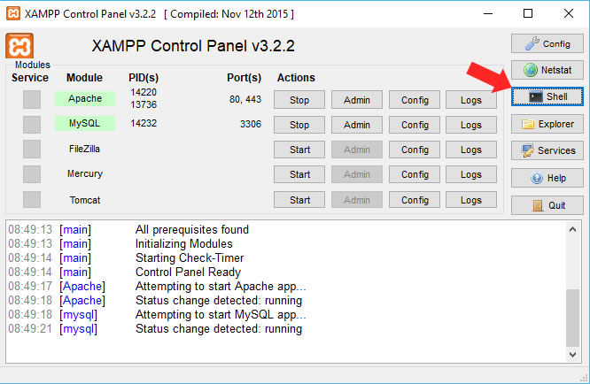
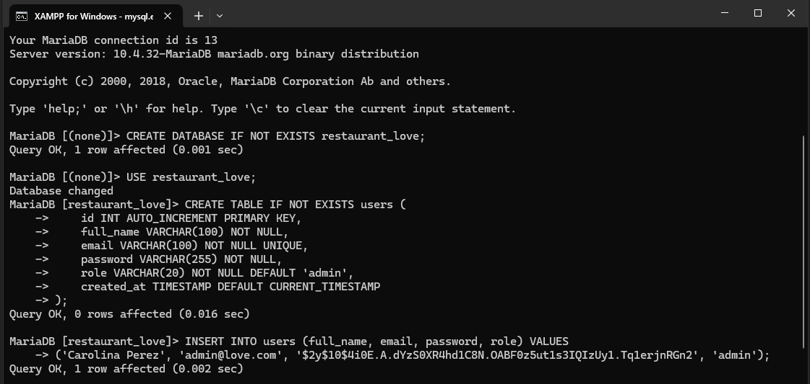

# Restaurante Love - Sistema de Gestión

## 📋 Descripción
Sistema web para la gestión de reservas y pedidos del **Restaurante Love**. Incluye módulos para:
- Administración de usuarios
- Gestión de reservas
- Visualización de menús

## 🛠 Requisitos
- XAMPP (Apache, MySQL, PHP)
- Navegador web moderno

---

## 🚀 Instalación

### 🔧 Configuración de la Base de Datos

1. Inicia **XAMPP** y activa los servicios de Apache y MySQL.
2. Abre la terminal de XAMPP:
   - Haz clic en el botón **"Shell"** en el panel de control de XAMPP.
   - Ejecuta el siguiente comando para acceder a MySQL:
     ```bash
     mysql -h localhost -u root
     ```
   

3. Crea la base de datos y las tablas necesarias:
   ```sql
   -- Crear y seleccionar la base de datos
   CREATE DATABASE IF NOT EXISTS restaurante_love;
   USE restaurante_love;

   -- Tabla de usuarios (administradores y gestores)
   CREATE TABLE IF NOT EXISTS users (
       id INT AUTO_INCREMENT PRIMARY KEY,
       full_name VARCHAR(100) NOT NULL,
       email VARCHAR(100) NOT NULL UNIQUE,
       password VARCHAR(255) NOT NULL,
       role VARCHAR(20) NOT NULL DEFAULT 'admin',
       created_at TIMESTAMP DEFAULT CURRENT_TIMESTAMP
   );

   -- Insert default admin user (password: 123, hashed) (https://onlinephp.io/password-hash)
  INSERT INTO users (full_name, email, password, role) VALUES 
  ('Admin', 'admin@love.com', '$2y$10$Ipfz3MPnMMMSZhawYcZbk.LhTByL5oXK1enTaG2zPzCxVk7PGALvi', 'admin');

   -- Tabla de reservas y pedidos
   CREATE TABLE reservations (
       id INT AUTO_INCREMENT PRIMARY KEY,
       document_type VARCHAR(10) NOT NULL,
       document_number VARCHAR(20) NOT NULL,
       full_name VARCHAR(100) NOT NULL,
       phone VARCHAR(20) NOT NULL,
       email VARCHAR(100) NOT NULL,
       menu_item VARCHAR(100) NOT NULL,
       table_number INT NOT NULL,
       service_type ENUM('restaurante', 'para-llevar') NOT NULL,
       status ENUM('pendiente', 'en_proceso', 'completado') DEFAULT 'pendiente',
       created_at TIMESTAMP DEFAULT CURRENT_TIMESTAMP
   );
   ```
   

---

## 📁 Estructura del Proyecto

- `index.html`: Página principal del restaurante  
- `servicios.php`: Formulario para realizar reservas y pedidos  
- `loginAdmin.php`: Acceso al panel administrativo  
- `includes/`:
  - `connection.php`: Configuración de conexión a la base de datos  
  - `pagIni.php`: Panel de gestión de reservas  
  - `user_management.php`: Administración de usuarios  
  - `logout.php`: Cierre de sesión  

---

## 🔐 Acceso al Sistema Administrativo

- **URL**: [http://localhost/restaurante_love/loginAdmin.php](http://localhost/restaurante_love/loginAdmin.php)  
- **Usuario**: `<user>@love.com`  
- **Contraseña**: `<password>`  

---

## ✨ Funcionalidades

- Gestión de reservas (crear, ver, actualizar estado)
- Administración de usuarios (crear, eliminar)
- Visualización de menú para clientes
- Sistema de pedidos para llevar

---

## 📝 Notas

- La tabla de usuarios tiene dos roles: `admin` y `manager`.
- Todos los pedidos inician con estado `pendiente`.
- Las reservas pueden ser **en el restaurante** o **para llevar**.
